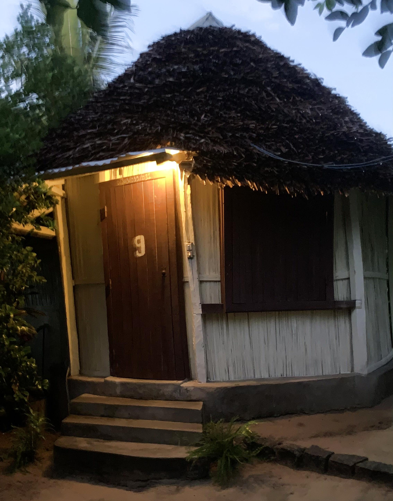
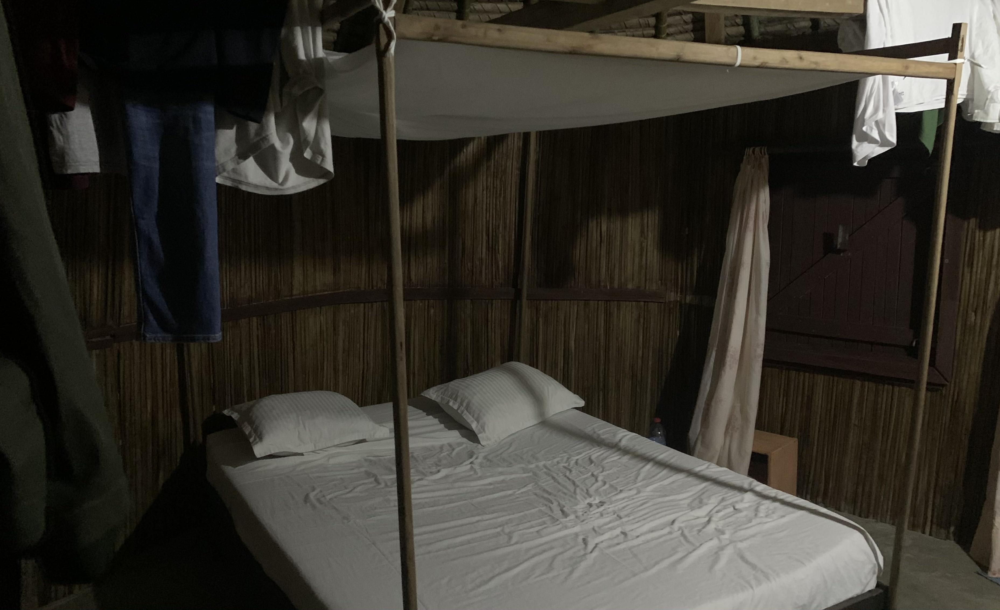
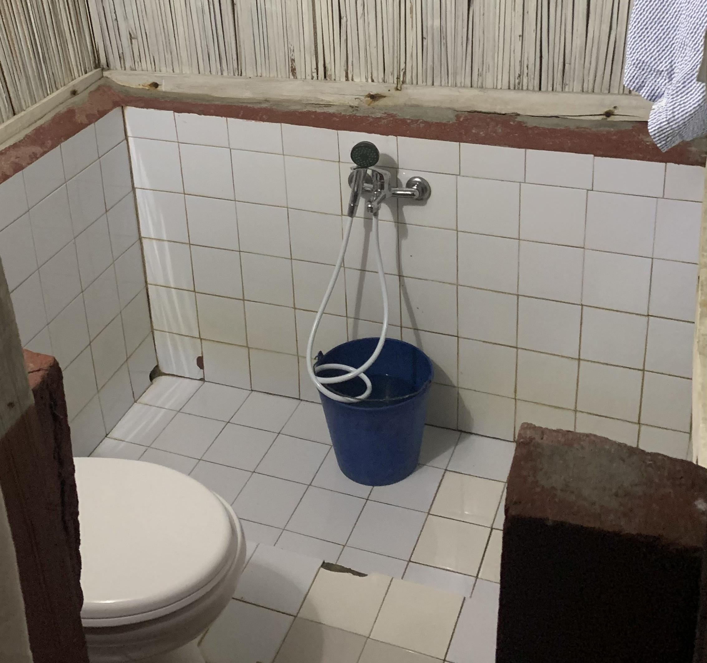
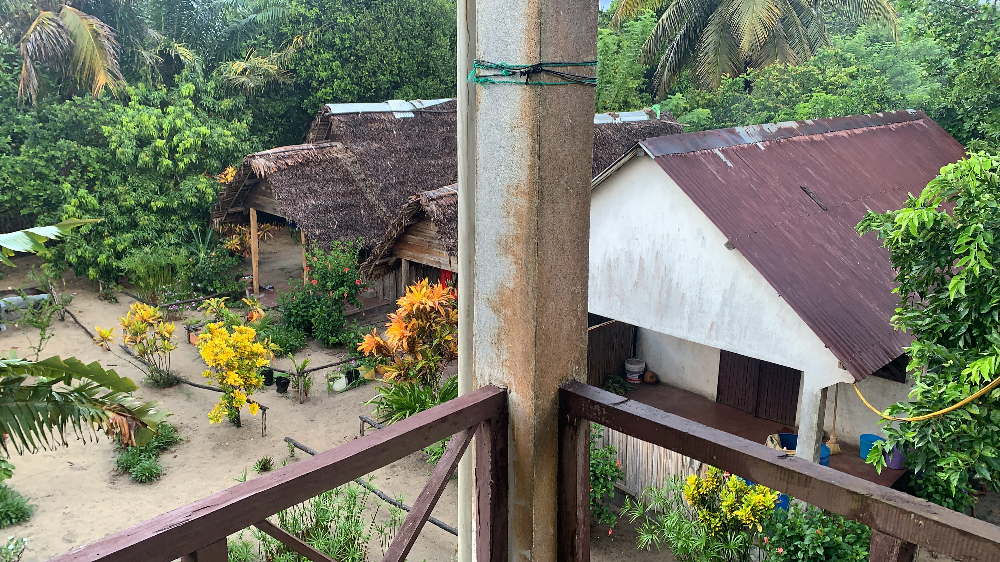
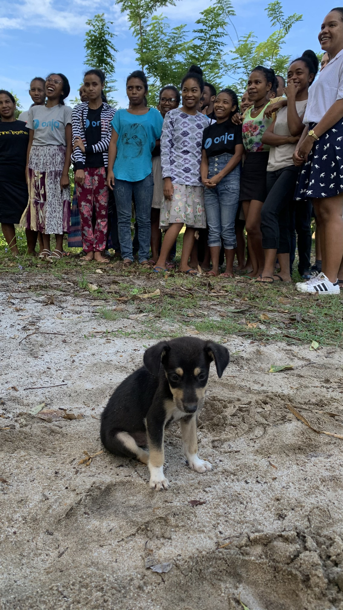

# Mein Leben auf Madagaskar: Teil 2

## Mahanoro & Onja

Wie sich schnell herausstellt, hätte ich mir keine Sorgen machen müssen. Ich weiß zwar nicht, wohin ich muss, für jemanden der nach einem hier übermäßig großen Europäer mit komischen Haaren Ausschau hält, ist die Sache aber ziemlich klar. (Ich werde hier dauernd gefragt, ob ich Basketball spiele, daran hat vorher noch nie jemand gedacht). Voangy von Onja ist zum Glück trotz dieser Uhrzeit zur Taxibus-Station gekommen und mithilfe eines angesichts meines übergroßen Koffers ziemlich geforderten Fahrrad-TucTuc-Fahrers (Motorisierte gibt es hier nicht) bringt sie mich zu meiner Unterkunft für die nächste Zeit, einem kleinen Bungalow bestehend aus Bett, einem Schreibtisch und ziemlich ordentlichem Bad.

Kurz darauf machen wir uns schon auf den Weg zur Schule, welche am anderen Ende von Mahanoro liegt. Wenn man die ganze Zeit über den Strand läuft (der beste Weg zur "Arbeit" überhaupt) braucht man zu Fuß ungefähr eine halbe Stunde.

 

<iframe style=" position: absolute;top: 0;left: 0;width: 100%; height: 100%;" width="794" height="541" src="https://www.youtube.com/embed/HIn5PVW-J_M" title="YouTube video player" frameborder="0" allow="accelerometer; autoplay; clipboard-write; encrypted-media; gyroscope; picture-in-picture" allowfullscreen></iframe> 

 

Auch von der Schule hatte ich vorher nur die verpixelten Hintergründe von Zoomkonferenzen gesehen, sie kann sich aber echt sehen lassen: Neben dem zweistöckigen Hauptgebäude in diesem wunderbaren türkis, in dem unten der Klassenraum und oben ein Arbeitszimmer und die Wohnung des Gründers Sam sind, gibt es noch eine Küche und mehrere kleinere Gebäude in klassisch madagassischer Art, in dem einige der Schüler leben. An drei von Seiten von üppigem Gestrüpp umgeben und auch sonst recht abgetrennt vom restlichen Mahanoro hat der "Campus" für mich etwas von einer Oase, nicht zuletzt, weil ich hier uneingeschränkt von Sprachbarrieren bin. Und dass der Strand nur 100m entfernt ist, ist auch nicht schlecht...

Alle Madagassen, die ich bisher getroffen habe, sind ausgesprochen offene, herzliche und entgegenkommende Menschen, und die Studenten bei Onja sind keine Ausnahme, im Gegenteil. Sie alle kommen aus Verhältnissen, denen „schwierig“ nicht gerecht wird (mir fällt aber nichts Besseres ein), mussten teils früh die Elternrolle für die Geschwister übernehmen und konnten zwar gute akademische Leistungen erreichen aber wurden dann durch Geldmangel oder Familienpflichten jäh gestoppt. Sahra zum Beispiel, die erste Studentin, die inzwischen einen festen Job hat, hat es sogar aus ihrer Heimatstadt heraus zum Studium in die Hauptstadt geschafft, nur um nach einem Jahr abbrechen zu müssen, um die Eltern zu unterstützen. Und das wäre es wahrscheinlich an Chancen für sie gewesen, so wie für viele andere junge Madagassen.

Es gibt viele positive Entwicklungen auf diesem Gebiet, so schließen inzwischen die meisten ihre Highschoolausbildung ab und es gibt eine dem Bafög nicht unähnliche Studentenfinanzierung, die die Abhängigkeit vom Einkommen und der Gesundheit der Eltern verringert. Insbesondere in den wirklich ländlichen Regionen Madagaskars, aus denen viele der Studenten kommen, ist das Leben der Menschen aber weiterhin dem Mittelalter ähnlicher als der Neuzeit. Keine der neunzehn Studenten, die Teil dieser ersten Onja-Generation sind, hatte vorher Kontakt mit Computern oder dem Internet gehabt, nur wenige waren mal in Tana, niemand hat so viele der bekannteren Orte von Madagaskar gesehen wie ich in meinen ersten zwei Wochen hier. Die unzähligen Privilegien, mit denen ich aufgewachsen bin, sind mir durch den Vergleich mit diesen Schülern nie klarer gewesen.

Und trotz all den schlechten Startvoraussetzungen, die sie erhalten haben, den Schicksalsschlägen, die sie wegstecken mussten, der madagassischen Kultur, die häufig Gehorsam und Tradition vor Initiative und Innovation stellt und einem Bildungssystem, das auswendig lernen statt lernen lehrt, trotz all diesem stehen diese Neunzehn kurz davor, ihren Durchbruch an die Spitze der modernen Welt zu schaffen.

Noch sind wir nicht an diesem Punkt, und zusammen mit den anderen Coding-Coaches Piero und Andrzej sowie der Englischlehrerin Mitansoa (Über die anderen Coaches mache ich bald was) und den anderen bei Onja haben wir noch eine Menge zu tun, insbesondere was ein wirkliches Verständnis für Codinggrundlagen angeht. Doch ich habe keinen Zweifel daran, dass sie es schaffen werden. Auf dem Weg dorthin sollten wir uns alle etwas von ihrem energetischen Optimismus und Lernwillen abschauen.

import Comments from '../../src/components/comments' 

<Comments /> 
